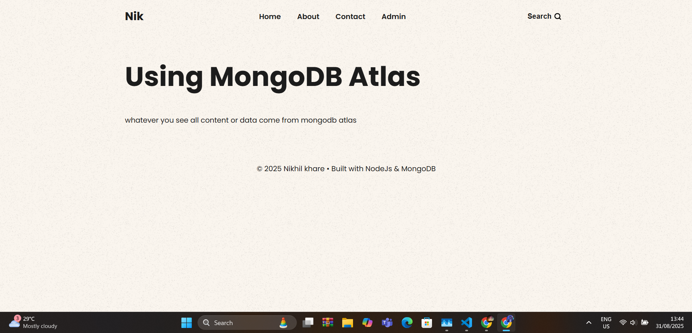
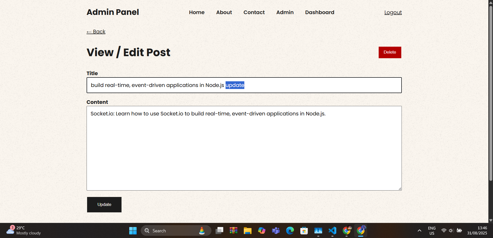

# Blog-backend

 # Getting Started with Create React App
# Todolist-Backend 
 # It is a Full stack web application

## About The Project

A blog website's backend serves as the server-side infrastructure that handles data storage, retrieval, and management. It provides the core functionality that allows users to create, publish, and interact with blog content.


## Key components and functions of a blog website backend include:

### Home Page

- React.js.
- Node.js.
- CSS5.
- Express.js.
- MongoDB compress.


### Key components

- Database Management:
- API (Application Programming Interface):
- User Authentication and Authorization:
- Content Management:
- Comment System:
- Search and Filtering:
- Server-Side Logic:
- Popular technologies for building blog website backends include Node.js with frameworks like Express.js, Python with frameworks like Django or Flask, PHP with frameworks like Laravel, and others like Ruby on Rails or Java-based solutions. The choice of technology depends on factors such as project requirements, scalability needs, and developer preferences.


## Usage

Install the dependencies using npm

   ```bash
   npm install
   ```

To start the development server run the following command :

# Server back-end & backend run
```bash
npm run dev
```






